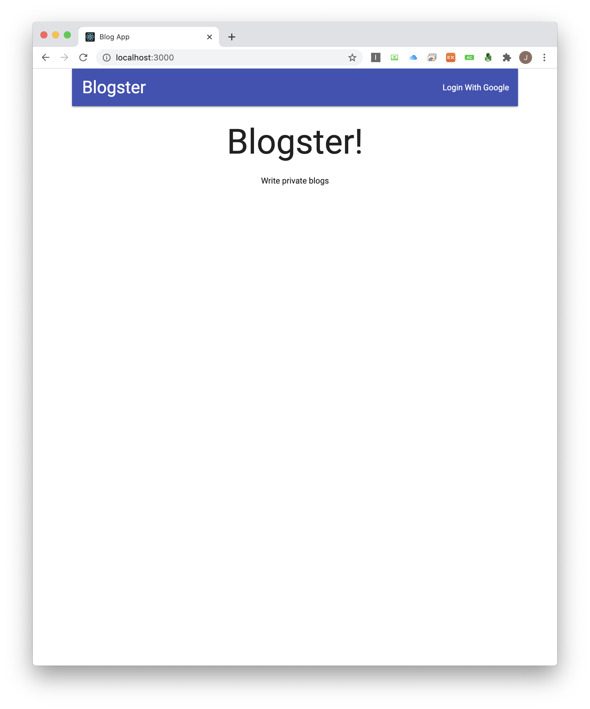

# advanced_node_starter

The project to implement performance improvement

## Caching with REDIS

This project use database as MongoDB with Mongoose ODM.
Tried to improve its performance by adding memory caching, REDIS.
It maintains nested hash structure to separate each user with each bucket.
When the state changes on the inside of interacting views, cached data flushes automatically.

## Automated Headless Browser Testing

This testing module is not unit test.
The written code is for integration test by using puppeteer.
Puppeteer launches headless browser, Chromium.
The objects inside of puppeteer like browser, page, and custom page are integrated into one class.
Test about user and session is automatically generated by factory.
This factory pretends already finished OAuth by SNS or third party platform.

## Continuous Integration with Travis using Github

Travis account is linked with Github account.
When the project pushed to the repository of Github, Travis cathes the changes from previous state on the project.
This CI process is not just detecting of the changes, also execute the test code on the environment which was given on travis.yml.
When the test successfully pass, notification send to the email on the Github.

## Image Upload by S3

This image upload process is not using multer-s3.
This part of the process is aiming performance improvement on the Cloud Server Computing.
Computing for upload is not in charge of backend code of ours.
Server only use api of AWS to get presigned-url.
When the api is verified and presigned-url issed to the backend, backend service send the url to the client.
Then, client send PUT request by using the given url.
S3 verifies the file that is correct format, name, type with signature and secret key which are registered on the IAM service on AWS.

## Demo

    
    
    

