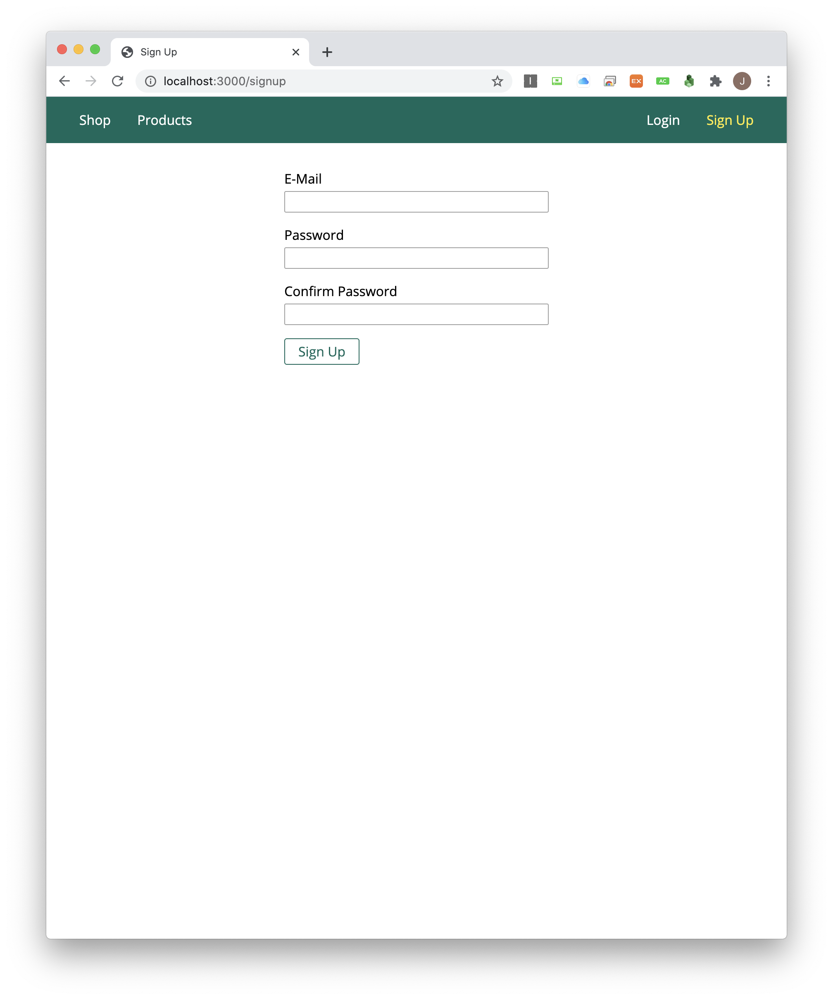
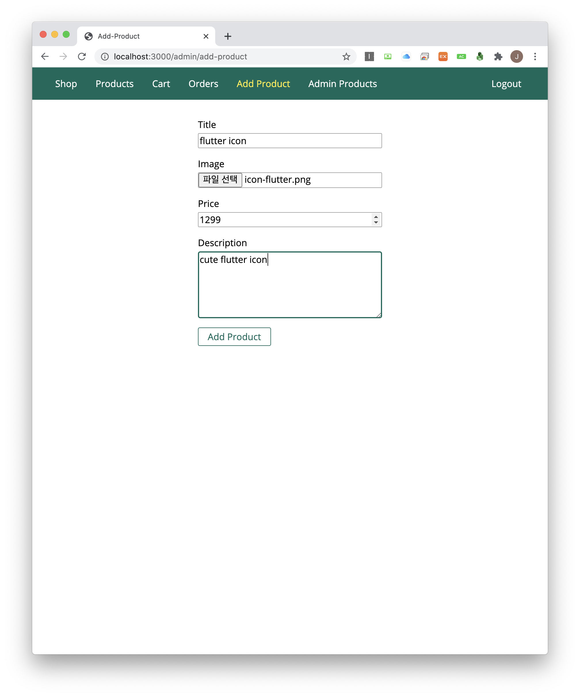
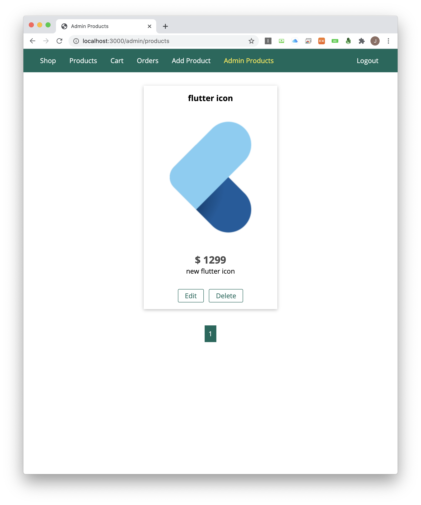
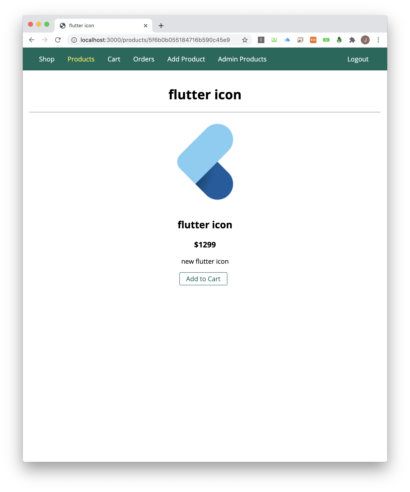
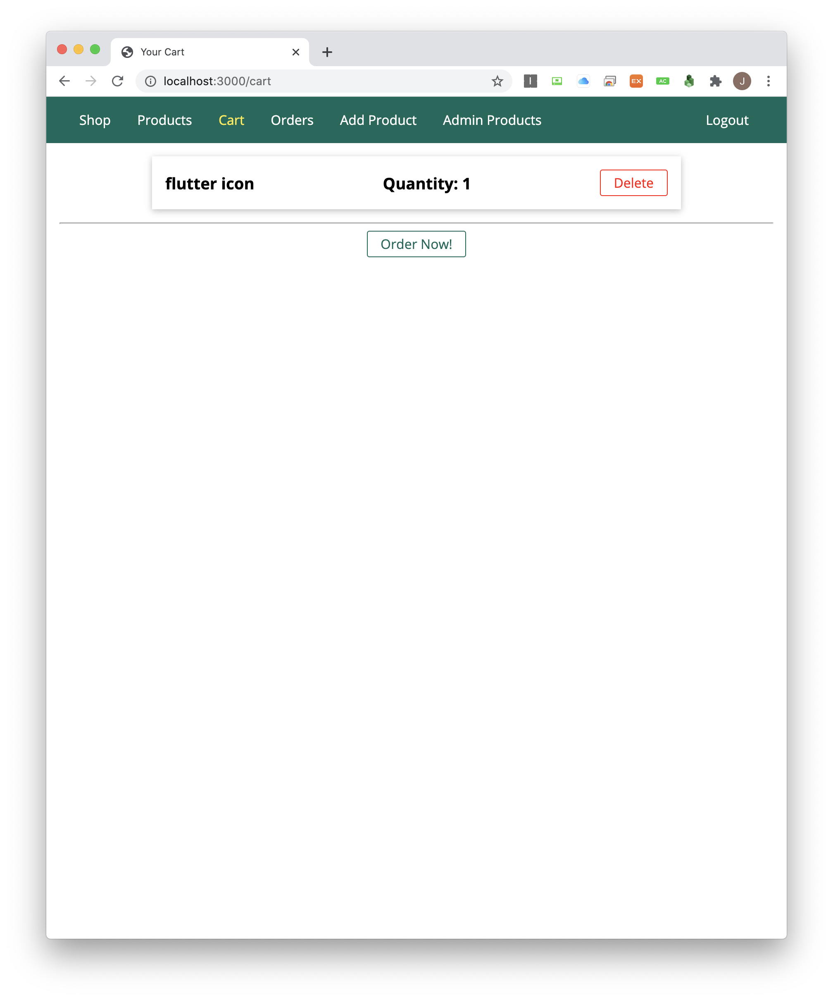
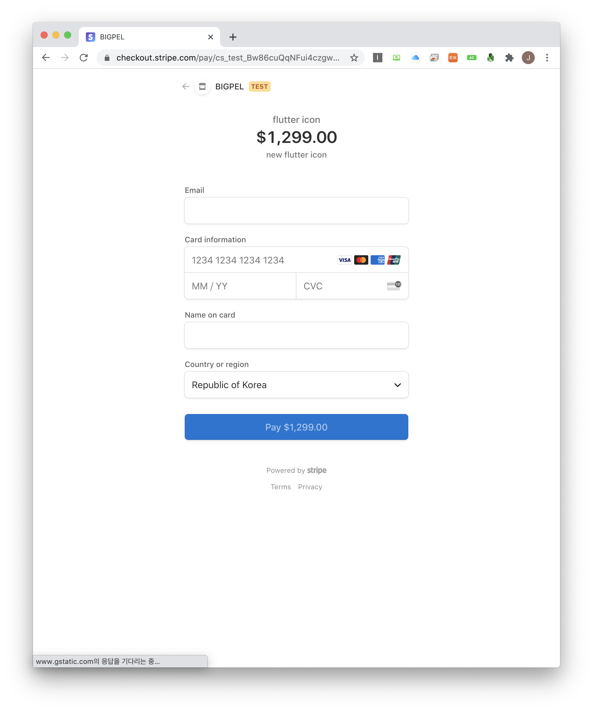
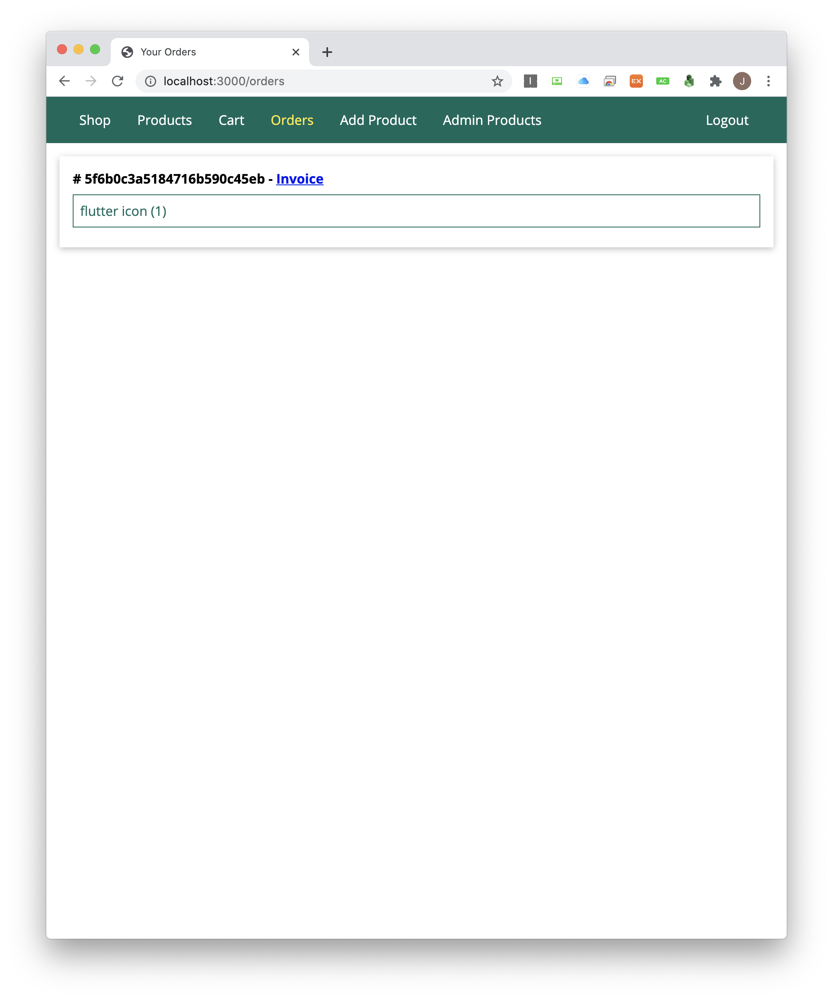
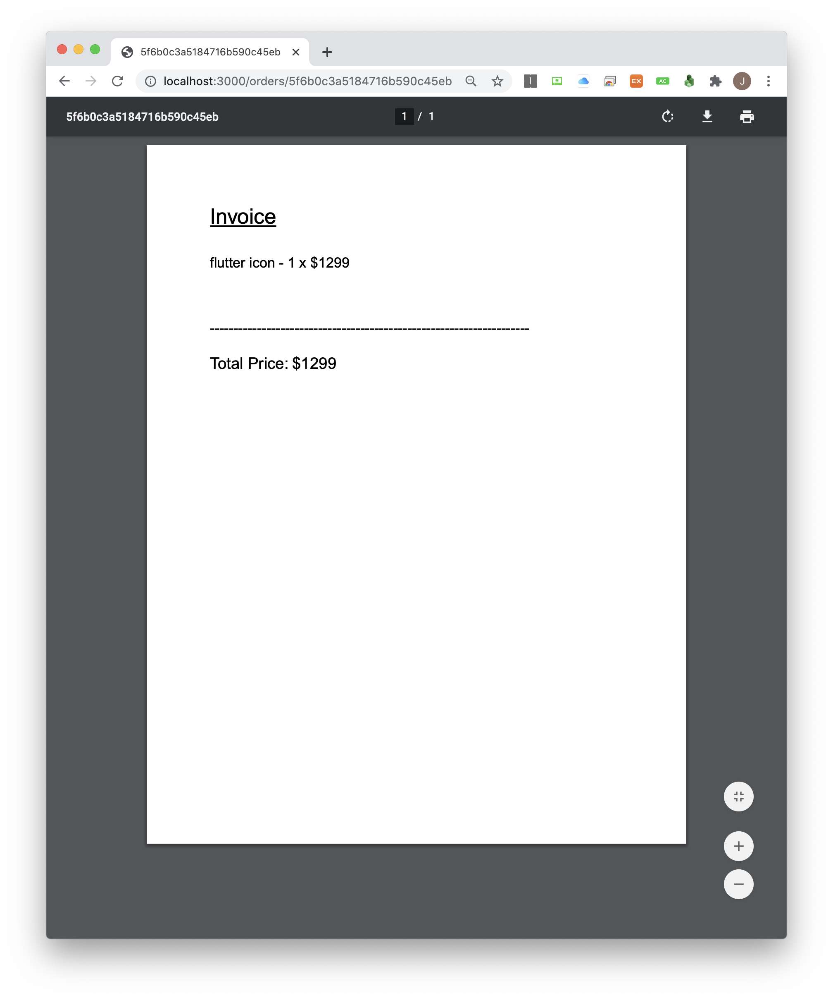

<h1 align="center">node_integrated_solution</h1>

    The Project to Experience the General Usage of Node.js with Database

## What is this project?

The retail shop for individual users.

## Features

1. The dynamic template "EJS" has been used as a view engine.

2. To use this web, must signed up and signed in.

3. Validator has been used to validate the input of the user information.

4. When user signing up or signing in, the encrypting and decrypting or validating algorithm in the bcrypt.js has been used.

5. User state is memorized on the session with cookie.

6. Session information is written on the MongoDB.

7. Product is written on the MySQL with using multer to image upload on the server. (paginated by offset and limit)

8. User can make payment through STRIPE API (not really paid because this is a test, more about on https://stripe.com/docs/testing)

9. When the user make payment successfully, the invoice payment pdf made by pdfkit is sent to the user email by SENDBIRD API with nodemailer.

10. This web service is hosted on the Heroku. (logging on the system is depending on the morgan locally instead of Heroku's)

11. Compression by compression, security improvement by helmet and csurf.

## Demo

    
    
    
    
    
    
    
    

