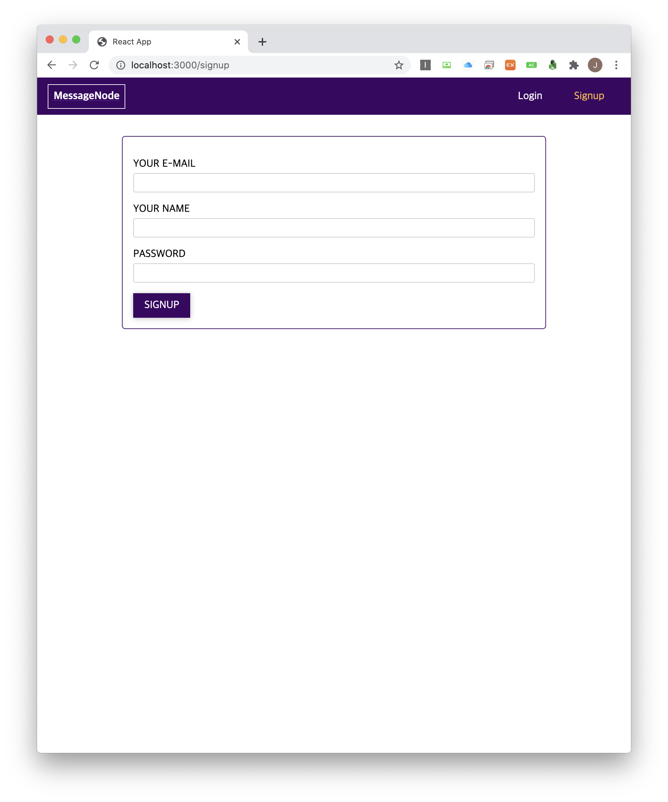
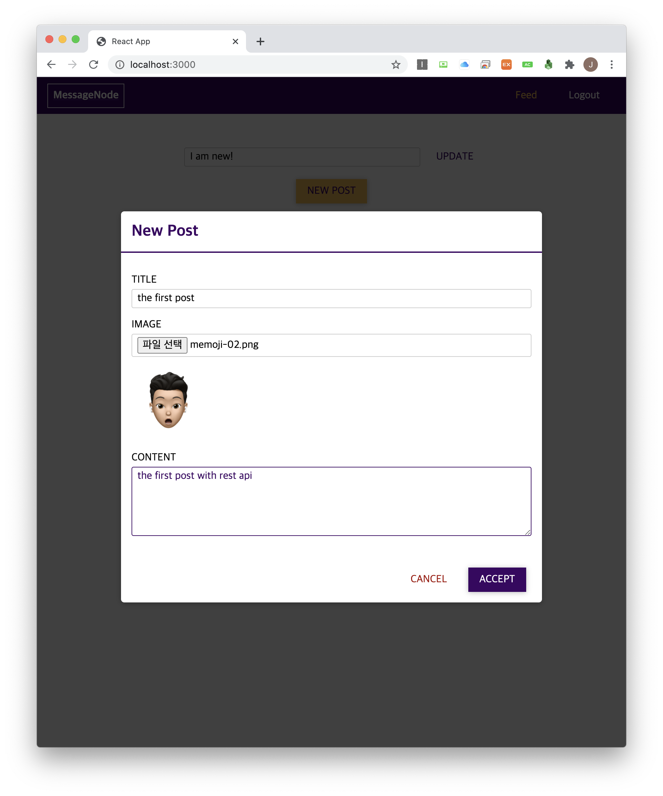
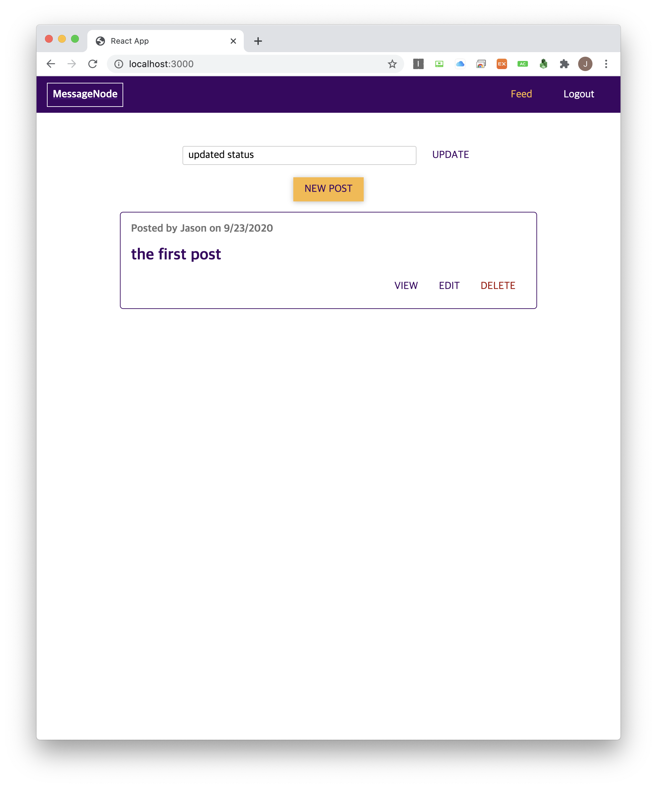
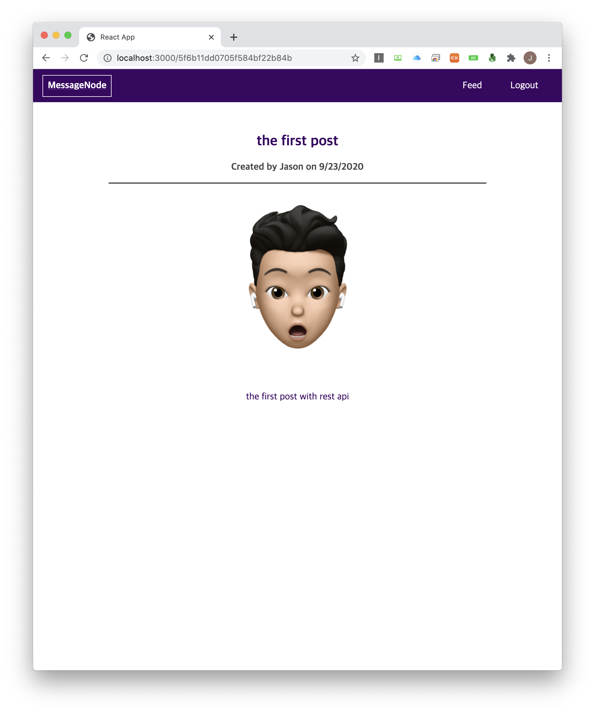

<h1 align="center">node_restapi_solution</h1>

    The Project to Improve Skills on the Backend Service by Using Restful Architecture and Graphql

## Features

1. User signing up and signing processed by bcrypt.js and express-validator.

2. Client and service communicates each other by REST API. There is no user state on the server like before when using cookie and session. Now backend issue JWT to the client.

3. REST API revised into the naive graphql.

4. Some experiment using web socket with socket.io on the project.

## Demo

    
    
    
    

