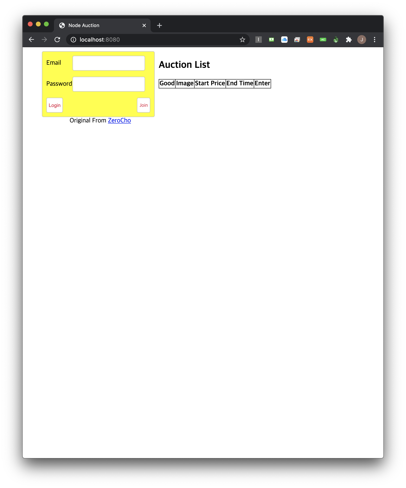
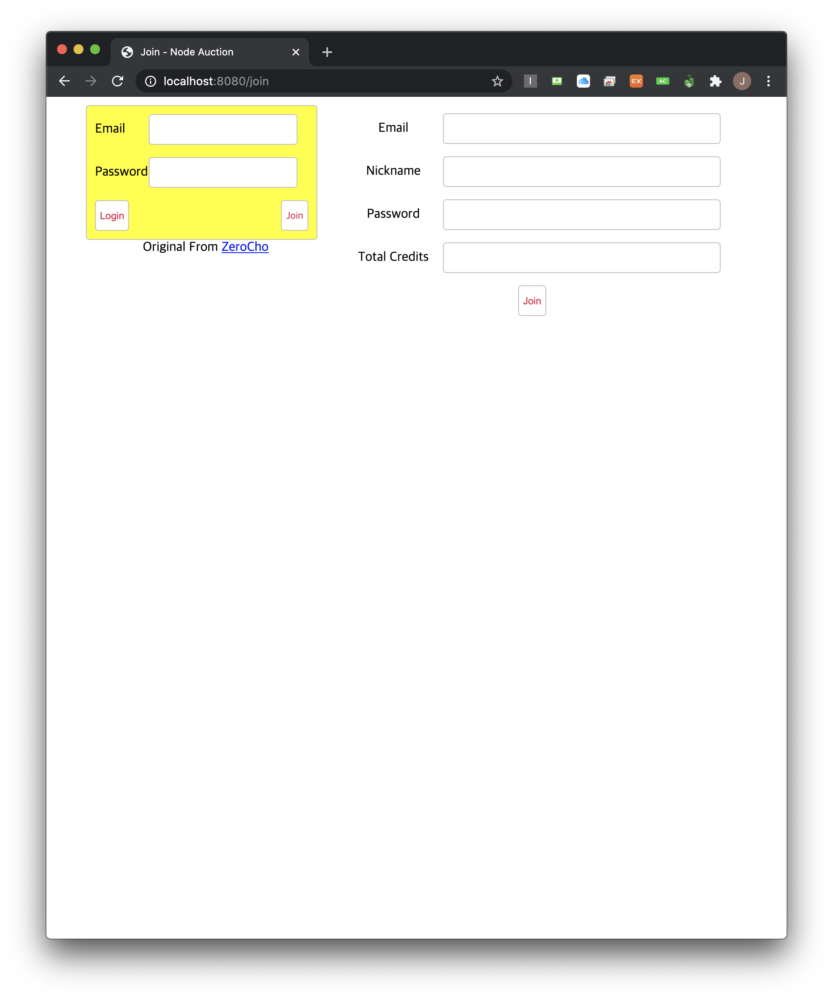
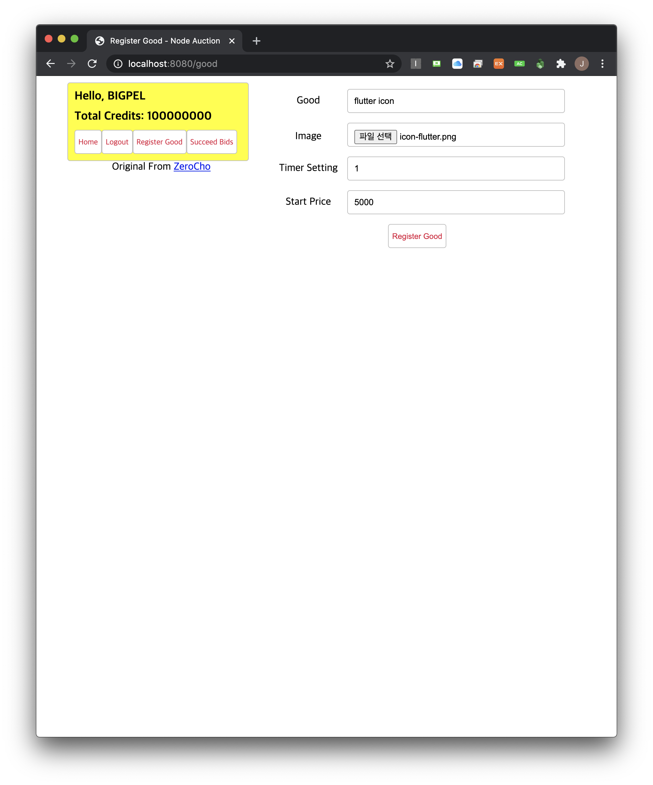
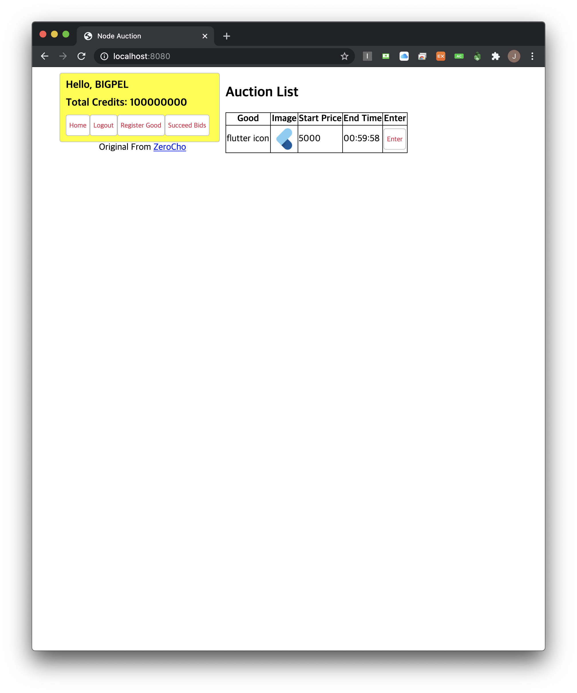
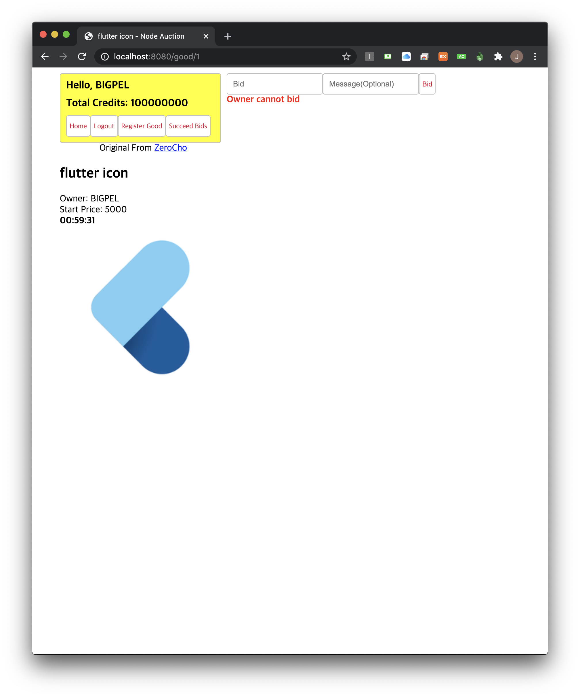

<h1 align="center">node_auction_application</h1>

    The project to improve skills of web socket with Express.js

## What is this project?

The real-time auction service.

## Features

1. This application should support real-time service, and this real-time should be shared on every user in this application. Thus, websocket of socket.io has been used.

2. User signing up and signing in processed by local strategy of passport by using bcrypt.

3. The backend has states of user. It writes every session of users on the backend.

4. Auction products are written on the database, MySQL (using Sequellize as a ORM)

5. Environment Variables are hidden by dotenv.

6. The expiration of counting timer is managed by node-schedule.

7. The part of the auction joining is using joining room of socket.io

8. Web Socket takes the app of Express.js and handles session middleware

9. Server sends event periodically by setIntervals and sse.

## Demo

    
    
    
    
    

