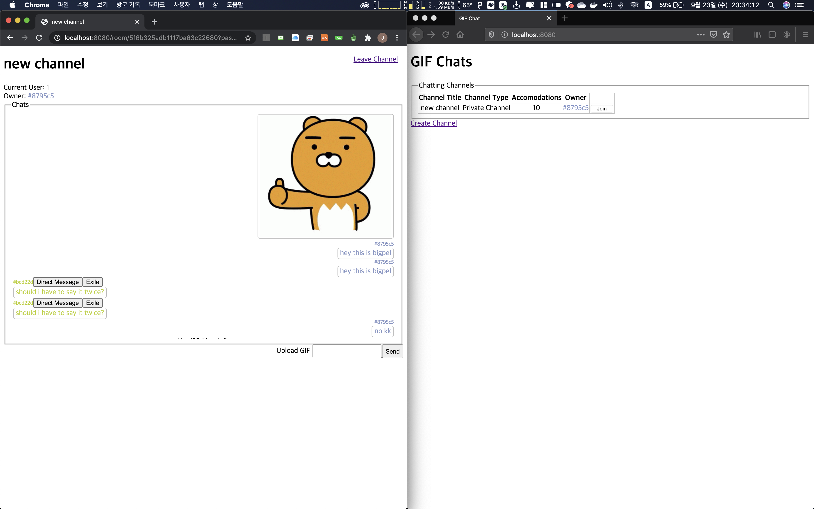

<h1 align="center">node_gif_chat_application</h1>

    The Project to Practice Real-Time Service by Using Web Socket

## What is this project?

This project is the real-time anonymous chatting service which allows sending gif image.

## Features

1. When user access to the application, express-session issues session to the current browser.

2. Because the system of this chatting application is running on anonymous, user need to be automatically distinguished and maintained as unique status in one room. This can be fulfilled by color-hash package. The id of each user is generated by hash function, so uniqueness of each user is guaranteed. In addition, the result is returned as a color, so each user can be distinguished. (The id of the issued session is required to generate random color by color-hash.)

3. Environment Variables are hidden by dot env.

4. The information of Chat and Room are saved on the database, MongoDB (using Mongoose as a ODM)

5. Backend service is running with Web Socket (socket.io package), and that Web Socket is using the session middleware of Express.js.

6. Of course the function of the room in the socket.io has been used due to this is a chatting application. However, the room function is not used in the object of the socket which is maintained as a singleton. Some of the functions in the socket.io is used in the Router of Express.js. Thus, they are collaborated with the database, MongoDB

## Demo

    
    
    
    
    

