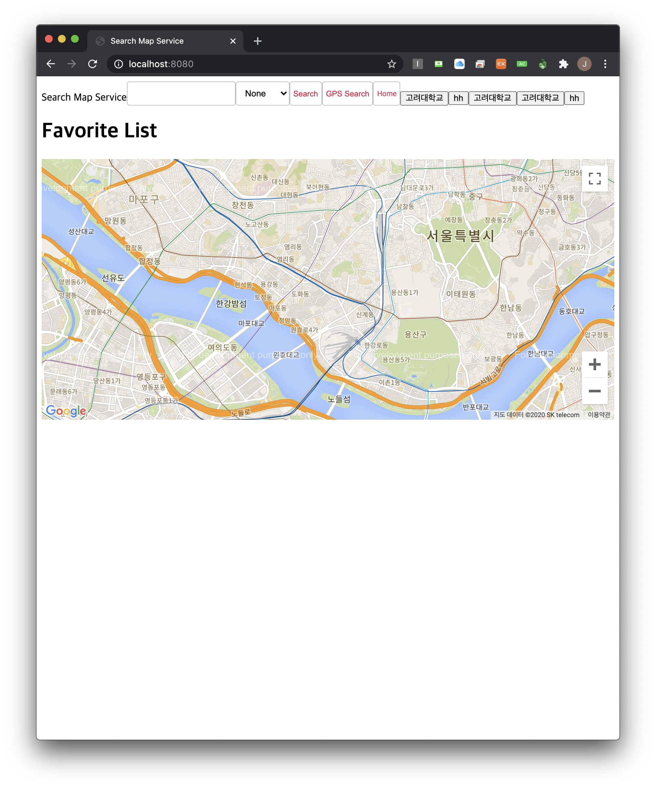

<h1 align="center">node_google_maps_application</h1>

    The Project to Practice the Search from the Database and Utilize 3rd Party API

## Features

1. Depending on the Map API from Google Cloud Platform

2. Using MongoDB and Mongoose

3. Loggin by "morgan"

4. API Request by "axios" on the client side

5. 2 keys for using Google Maps on the client-side and server-side

6. Providing Histories and Favorites services

## Demo

    

-   Because of the billing problem, API Request is broken down
-   This problem cause not to take screenshot well on this application
