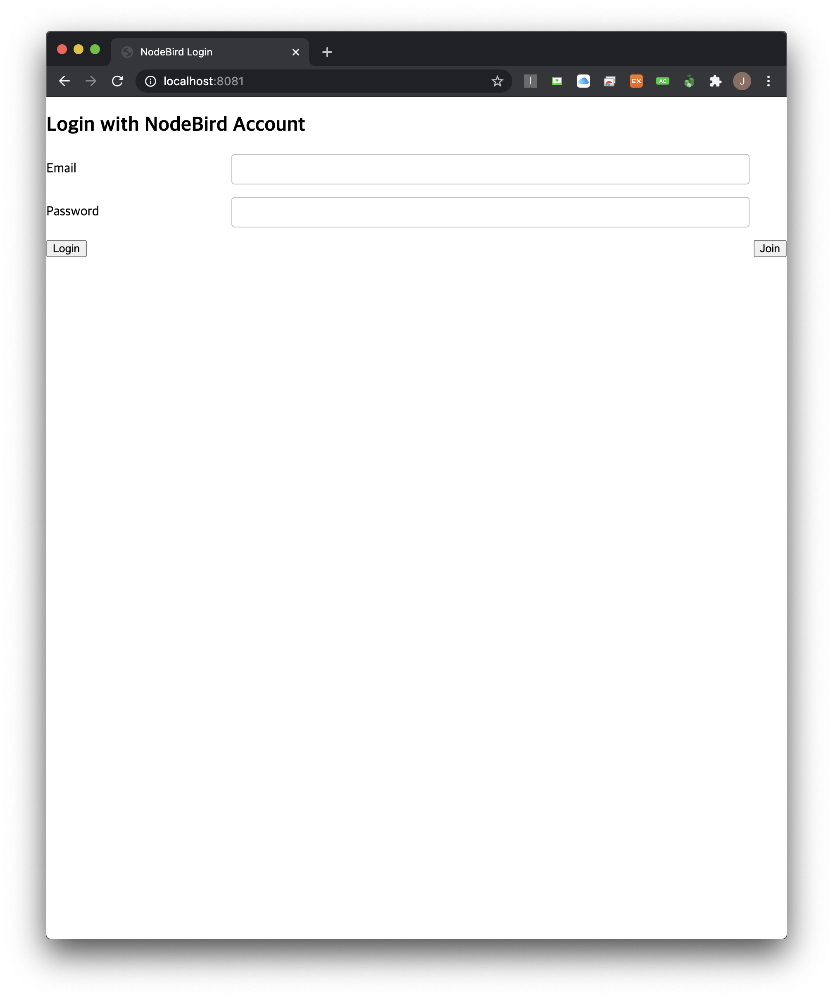
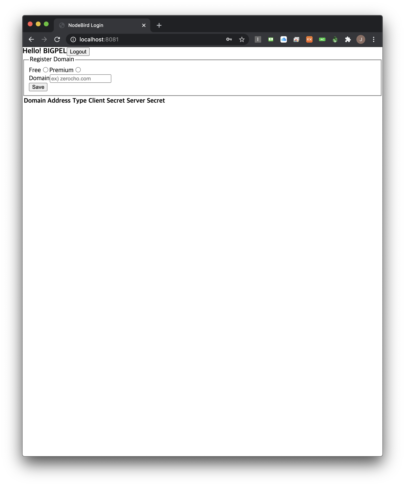

<h1 align="center">node_sns_api_application</h1>

    The project to implement API Server which provides SNS service functions

## What is this project?

This is the API Server to provide the information on the SNS service application. Recommend the users to use the API Server instead of web crawling to reduce the traffic on the server of the SNS application.

This project is related to the projects below.

-   node_sns_application

    https://github.com/bigpel66/nodejs-practice/tree/master/inflearn/Node.js%20Book/node_sns_application

-   node_sns_call_application

    https://github.com/bigpel66/nodejs-practice/tree/master/inflearn/Node.js%20Book/node_sns_call_application

## Features

1. User can sign in to the application to register to use API from the server. When the user signed in and want to use API from the server, the user must register own domain to the API Server. If the registering domain succeed, the server issues client key and secret key. (Both keys are created by uuid)

2. There are difference between Free API Channel and Premium API Channel. (This function is implemented by express-slow-down and express-rate-limit)

3. To use the API from the server, the user must create the temporarily alive token through the issued key.

4. The version of API is specified. If the old version is deprecated, the user would better use newer version of the API.

5. If the provider of the resource and the user of the resource is different from each other, the CORS Error could be happend. This project has to consider the CORS Error. (Because the API that sybolize resource is provided by this server, and this server should provide the infomation to the registered domain.) Must not allow all the domain to use API from this server. Only registered domains are allowed to use the API from this server. (The middleware regarding the request header before the API Handler could solve it by using "cors" package)

## Demo

    
    

