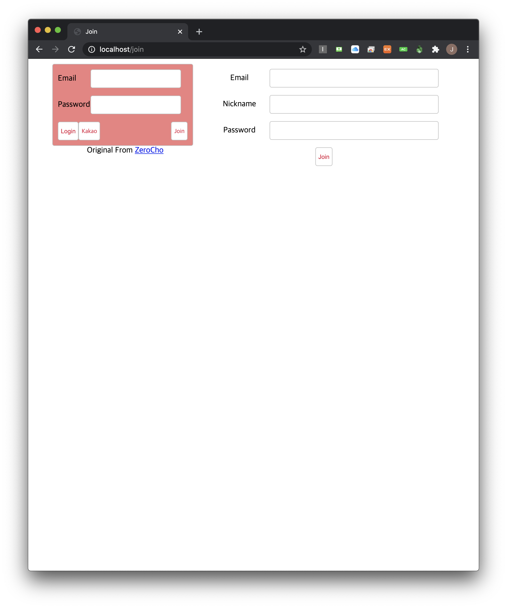
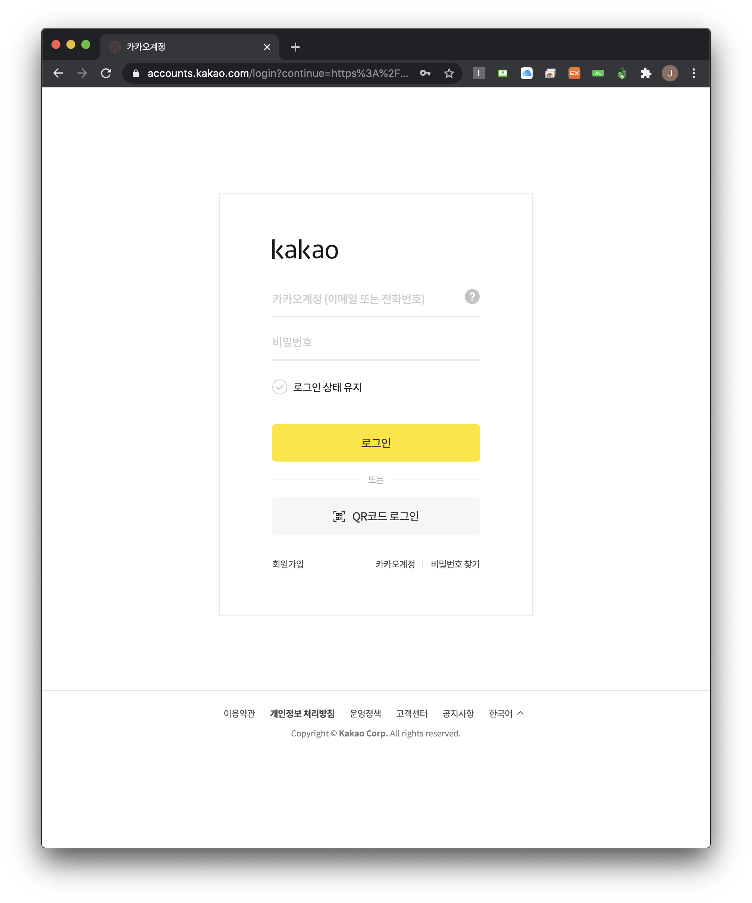
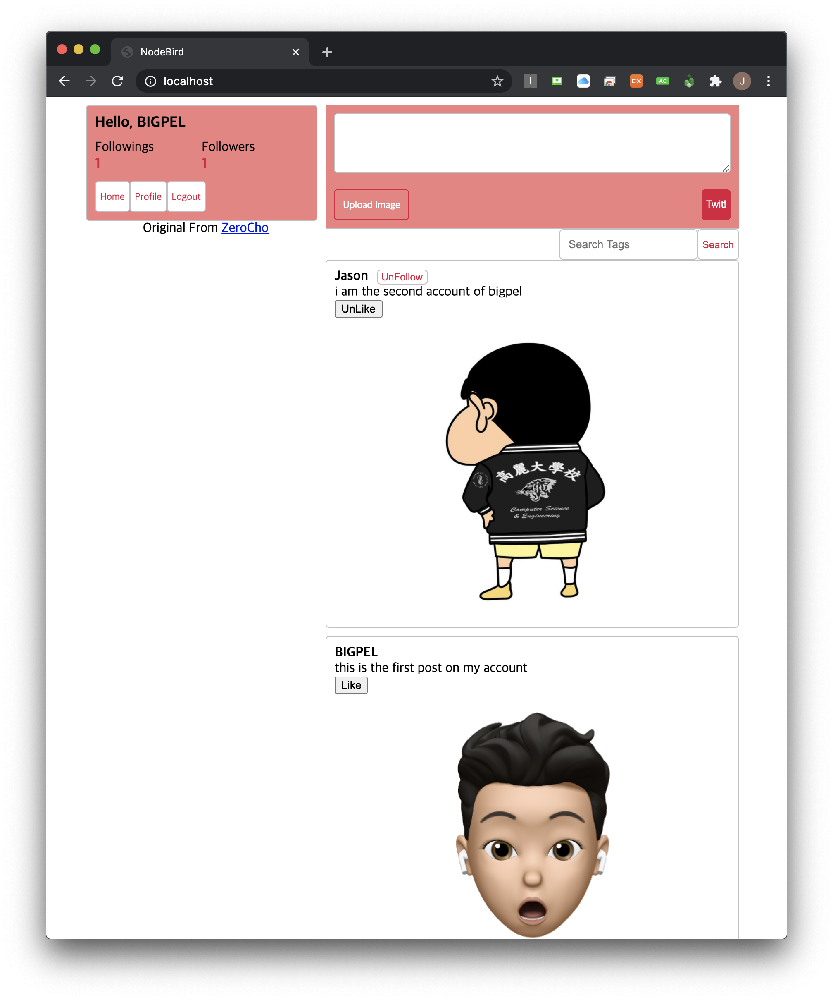
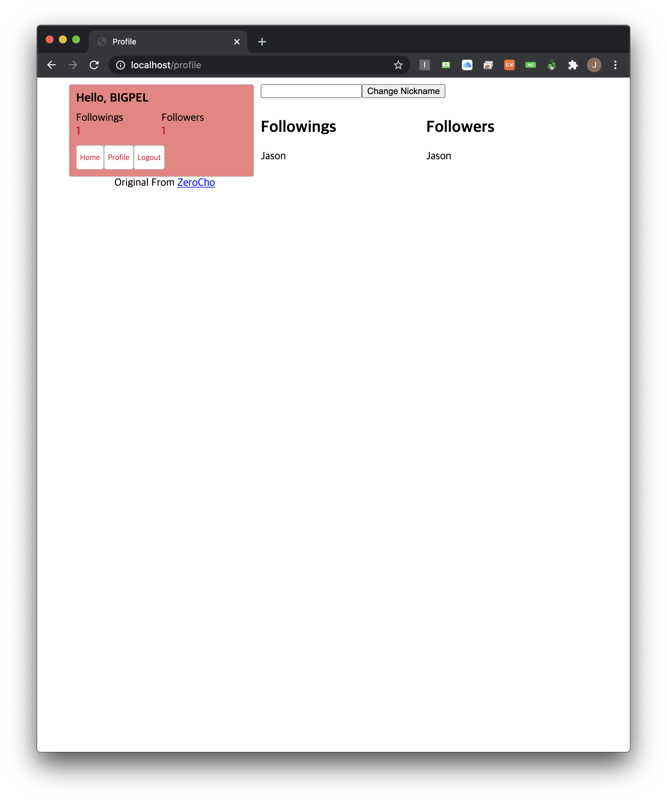

<h1 align="center">node_sns_application</h1>

    The project to implement SNS service

## What is this project?

This is the SNS application which supports Hash Tags, Likes, Followings & Followers, Posts with an image, Kakao Login.

This project is related to the projects below.

-   node_sns_api_application

    https://github.com/bigpel66/nodejs-practice/tree/master/inflearn/Node.js%20Book/node_sns_api_application

-   node_sns_call_application

    https://github.com/bigpel66/nodejs-practice/tree/master/inflearn/Node.js%20Book/node_sns_call_application

## Features

1. User signing up and signing in are managed by passport. This project is supporting local strategy and kakao strategy. (Kakao API by registering the application)

2. This application use the MySQL as a database with Sequelize. For the fast response of the request, it uses memory database "REDIS" for caching. (User sessions are saved on REDIS, too)

3. Environment Variables are hidden by dotenv.

4. "morgan", "hpp", "helmet", "winston", "winston-daily-rotate-file" are used for deploying application.

5. Models are associating to maintain the relationship each other.

6. Searching post by hash tag is enabled.

-   1:N

    User - Post

-   N:M

    Post - Hash Tag

    User - User (Following & Follower)

    User - Post (Like)

## Demo

    
    
    
    
    

