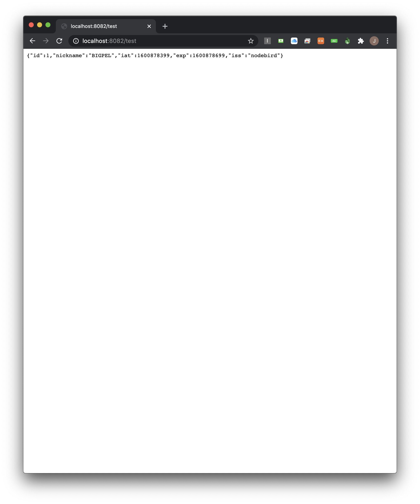

<h1 align="center">node_sns_call_application</h1>

    The project to test the implemented API server

## What is this project?

This project is the API Call Server which calls the API from the other server. Pretend this project is the normal service that is using third party API from the other server by using issued key.

This project is related to the project below.

-   node_sns_application

    https://github.com/bigpel66/nodejs-practice/tree/master/inflearn/Node.js%20Book/node_sns_application

-   node_sns_api_application

    https://github.com/bigpel66/nodejs-practice/tree/master/inflearn/Node.js%20Book/node_sns_api_application

## How to Use the Server

1. This is as same as the other normal backend service which is using third party API. To use the API from other server, access to the api register web page and register the domain of this server to issue the client key and secret key.

2. When the user of this server was provided the 2 keys successfully, add them to the dotenv file.

3. The request to the API Server could have not contained the token. If there is no token in the request header, get the token by using the secret key that has been issued. (The API Services are access by the token from key, not using key directly.)

4. Call the API from the other server by using the issued token. (To remove repetitive code to call the API, the refactored "request" function could be helpful.)

## Demo

    
    

